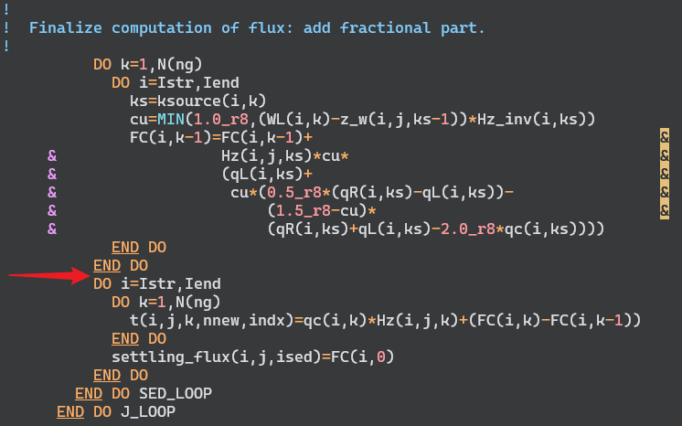

# turn on the functions in '\*.h' or '*.in' file  

There might be some differences in different versions of ROMS code. We may take ROMS3.7 as an example, and mark the version if it is for another version.

----------------------------------------------

## tidal forcing  

define the following options in '*.h' file

> \# define SSH_TIDES  
> \# define UV_TIDES  
> \# define RAMP_TIDES (not necessary but better to have it)  

## Coriolis force  

Sometimes, we may want to configure the idealized case to have some experiments. Removing the Coriolis force makes things more simple.  
There are two ways to do this:  

> (1) set f = 0.0 in the input grid file  
> (2) remove the "\# define UV_COR" in '*.h' file  

## about the particle sinking  

This is try to keep the vertical sinking process, but not deposite to the seabed.
This may be helpful for checkingthe vertical sinking process of sediemnt or the BGC particle materials.
Add the following code 

```fortran
DO i=Istr,Iend
   FC(i,0) = 0.0_r8
END DO
```

in "Fennel.h"


in "sed_settling.F"
